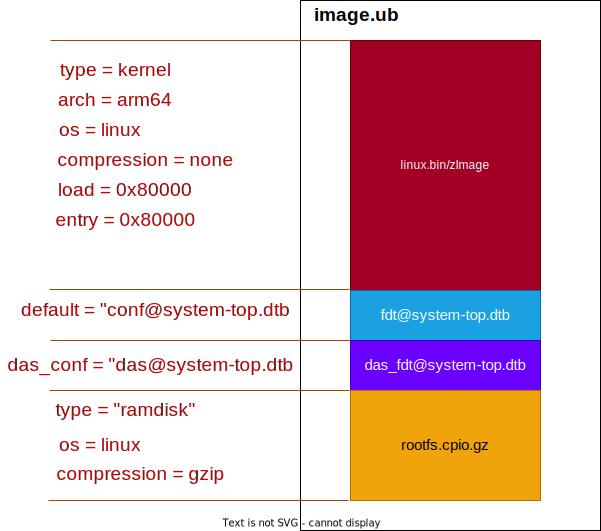
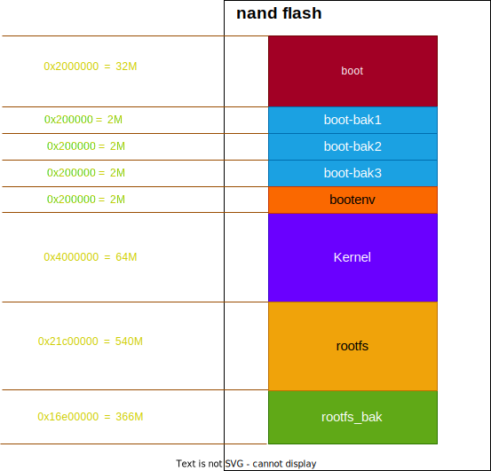
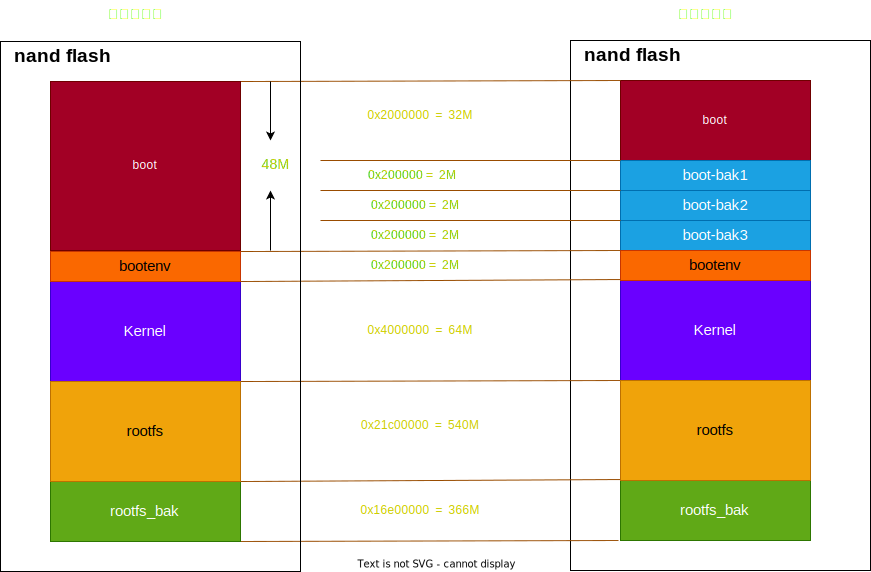

 M2RU底层详细设计

&nbsp;
&nbsp;
&nbsp;
&nbsp;
&nbsp;
&nbsp;

|版本|简介|编辑日期|作者|
|---|----|----|----|
|V0.1|初稿|2022-03-15|January|

 
目录

[toc]

#综述

#  1. 概述 

## 详细设计背景
- m2ru-oran底层只有一个boot备份，一旦启动坏掉，设备即刻成砖，急需提高设备容错率
- 目前产线生产流程中，ORAN设备需要在DAS设备基础上进行烧写底层，才能转换成ORAN设备，增加了产线负担
- 外场das设备升级成oran设备过程中，往往伴随着升级风险

## 详细设计目的

- boot启动分区增加至4个，大大减小设备启动失败的风险
- 减少产线在线升级oran底层带来的额外操作及风险
- 合并das/oran底层版本，减少底层后期维护成本

---

# 2. 模块设计

## UBOOT模块设计

### uboot启动逻辑设计
- 在uboot加载内核kernel时，通过解析kernel头部信息获取内核加载地址、设备树等信息
- 通过获取到的fit_uname_config到kernel头部轮询到设备树节点(按字符串为key值)，再将其加载到内存中
- uboot将设备树dtb的地址传给kernel，然后进行加载内核，控制权移交给内核即可

### 设备识别das/oran

- 设备采用环境变量的方式进行das/oran机型识别
- 该环境变量名称为das_platform
- 当设备处于默认情况下，das_platform环境变量为空，该设备为oran设备
- 当setenv das_platform das@system-top.dtb时，设备转变成das设备

```mermaid
graph LR
    A[fsbl] --> B(uboot) 
    B --> C{platform}
    C -->|platform = das| D(das_dtb)
    C -->|platform = NULL| E(oran_dtb)
    E -->|加载| G[kernel]
    D --> |加载| G
```

## 设备树模块设计

- 由于m2ru平台的das和oran的FPGA完全不同，无法做到兼容，故需要设备自己知道是oran还是das设备，以按照不同的FPGA版本加载对应的设备树，进而加载不同的设备驱动
- m2ru设备按照das和oran的FPGA的xsa文件进行分开编译各自平台设备树
- 根据oran/das项目需求，自行添加完善设备树

## 内核模块设计

- das/oran共用驱动，如flash驱动、eth0驱动等不用特殊进行处理
- ptp驱动、ecpri/cpri网卡驱动等务必使用设备树配置进行加载
- DTB文件按照das_fdt@system-top.dtb/fdt@system-top.dtb描述符链接到image文件中

## 驱动模块设计

### ecpri/cpri网卡加载

- das设备加载cpri网卡，对时钟没有额外要求，故不受影响，可正常进行加载
- oran设备加载ecpri网卡时，由于该网卡需要n850晶振输出时钟作为clk，因此，加载该网卡时需要配置850晶振
- 目前m2的设计是850晶振通过FPGA连线到ARM侧，因此需要提前加载FPGA，然后控制850时钟，最后加载ecpri网卡

此时有个疑问，没有加载FPGA的话，xilinx_axienet驱动能否正常加载PHY驱动，因为此时mdio是找不到PHY的(由FPGA模拟产生)
```mermaid
graph LR
    A(axienet_open) --> B(axienet_device_reset) -.-> K(重置xilinx_axienet mac)
    A --> C(of_phy_connect) 
    C --> D(phy_connect_direct) -->E(phy_init_hw)
    D --> X(phy_start_machine) -.-> 开启phy状态机
    C --> T(of_phy_find_device) -->bus_find_device-.->找到PHY设备
    E --> F(phy_device_reset)
    E --> G(soft_reset)
    E --> H(phy_scan_fixups)
```
通过上述梳理源码可知，xilinx_axienet的Mac驱动初始化只针对Mac层操作，虚拟phy并不需要对应的驱动，包含在axienet_open操作中

**DAS设备加载cpri网卡加载顺序为：**

```mermaid
graph LR
    A(kernel) --> |加载|B(FPGA.bit) 
    B --> |启用网卡| D(ifconfig eth0 up)-.->E(使用网卡)
```
**或者**
```mermaid
graph LR
    A(kernel) --> |启用网卡| D(ifconfig eth0 up) --> |加载|B(FPGA.bit) -.->E(使用网卡)
```
**ORAN设备加载ecpri网卡加载顺序为：**
```mermaid
graph LR
    A(kernel) --> |加载|B(FPGA.bit) 
    B --> |配置| C(n850时钟)
    C --> |启用网卡| D(ifconfig eth0 up)
```
### ptp驱动加载

**由于只有oran设备才有ptp驱动，故需要在驱动和设备树中进行修改**
- 在oran平台的设备树中添加关于ptp的节点描述sunwave,timer-1588-2.0
- 将sunwave_ptp_timer驱动移植到内核中进行加载，加载的描述符由设备树进行指定
- ptp驱动针对FPGA的timer模块进行相应的功能控制和中断注册

## 设备分区划分

## 升级模块设计

#### 向前升级兼容

##### 需求描述

- 在外的oran设备，有些客户需要对以前的大包进行升级，因为该以前版本大包是其仔细验证过的版本，是可靠的，只认准该版本进行升级，所以m2ru项目需要向前升级进行兼容。
- 升级过程中，设备应用层数据确保不能丢失。

##### 存在问题

- 以前oran版本大包是自带底层升级包的，该底层版本是没有备份系统的，分区划分也不一致，执行旧的大包中的升级底层脚本会导致设备挂掉。
- 设备应用层的数据是不能丢失的，一旦分区改变，该ubi文件系统被破坏掉，arm等配置文件均会丢失

##### 解决方案

- kernel分区和rootfs分区的flash相对偏移offset均保持不变，详情见下图分区划分对比。这样可以做到升级过程中不破坏rootfs及rootfs_bak分区，完好保留上层数据。
- boot分区(boot0)分配32M内存，用以保留升级以前boot文件的能力，还能保证当初底层默认bit文件(以前的oran设备是使用底层bit文件的，并不另行加载)

##### 结果验证

- 由于目前在线升级系统，均是使用mtd进行升级，因此按照之前升级脚本逻辑，会对mtd0/mtd2进行擦写操作。
- 对于新底层而言，擦写以前的boot是可以执行成功的(mtd0空间足够)，但mtd2由于分区改变只有2M，因此读写操作失败，退出升级流程。
- 结果而言，设备重启后，设备的boot换成了旧大包中的boot，boot_bak1/boot_bak3仍为升级前boot备份，boot_bak2被擦掉。kernel保留升级前内核。
- 设备可以正常运行，应用层数据完好无损，已通过测试验证。

##### 升级风险

- 以前存在某个版本的大包里的升级脚本，有个升级逻辑是，只要读写flash不一致，就会无限次数进行升级操作，断电重启后仍然会继续无线升级。该大包会导致设备陷入无限重启中，设备无法正常运行。
- 由于需要向前兼容，所以，该版本是没有对boot进行备份的，仅有boot_bak1/3的新底层boot备份，可能会有坏块等未知风险存在，建议升级使用最新的底层包。

#### 向后升级兼容

- 向后进行兼容升级，由于分区一致，故可以直接使用升级脚本进行升级操作即可。
- 目前经过测试，该升级功能一切正常，未出现升级失败情况。

#### das/oran互相升级

##### 需求描述

- 产线生产过程中，先是生产处das版本，然后通过在线升级成oran版本进行测试的
- 外面的das设备也是有需求转换成oran设备的
- 某些特点情况下，oran设备需要保留转换成das设备的能力

##### 实现方案

**DAS设备转换成ORAN设备：**

- 擦除env分区，或者擦除das_platform环境变量
- 升级大包中包含kernel_load_fpga.sh脚本进行替换，默认使用initramfs文件系统中的bit文件进行加载，若/dryfly/app/FPGA.bit存在即加载最新的bit文件
- 使用n850时钟配置工具配置ORAN时钟
- 再启用ecpri网卡进行使用

**ORAN设备转换成DAS设备：**

- 烧写env分区，或者修改das_platform环境变量
- 升级大包中将/drgfly/etc/kernel_load_fpga.sh脚本使用/etc/kernel_load_fpga.sh底层默认脚本进行替换

**产线裸板升级成DAS设备：**

- 产线自动烧写脚本中增加一行命令"setenv das_platform das@system-top.dtb" "seveenv"命令即可底层进行切换

**注意事项：**

- 理论上不支持ORAN设备切换成DAS设备，只是设计上保留该情况下设备的升级能力，实际测试也ok，但不建议。
- 目前该设计底层不存在ORAN/DAS底层，需搭配相应的上层才能切换到相应的平台。

# 接口设计

## FPGA驱动接口设计

**略**

## GPIO驱动接口设计

**略**

## N850时钟驱动接口设计

**略**

## PTP状态/配置/驱动接口设计

**略**

# 评审结果须知

## 底层方案评审结果

以下是评审得出的新底层v4.0需要满足的要求，如下：

1、Das和oran共用底层（v4.0）  
2、Das应用层不需修改  
3、Das不带boot备份底层可以升级新版本  
4、Oran新旧版本互相升级版本，不会挂掉  
5、Das带boot备份版本（>=v1.5）不能升级到v4.0版本  
6、V4.0适用范围在制、库存、返修 

## 结果评析

- 产线目前das带boot版本(>=v1.5)是大改过底层分区的，与当前ORAN底层、以前ORAN底层、以前DAS底层均不兼容，无法通过在线升级进行更新。
- DAS带boot备份版本(>=v1.5),无法与现网中ORAN设备进行兼容，当前似乎也没有ORAN版本与之搭配使用。
- 该新方案仅需满足在制、库存、返修设备的适用范围，不需要兼容当前产线最新das设备，似乎也没法进行兼容。